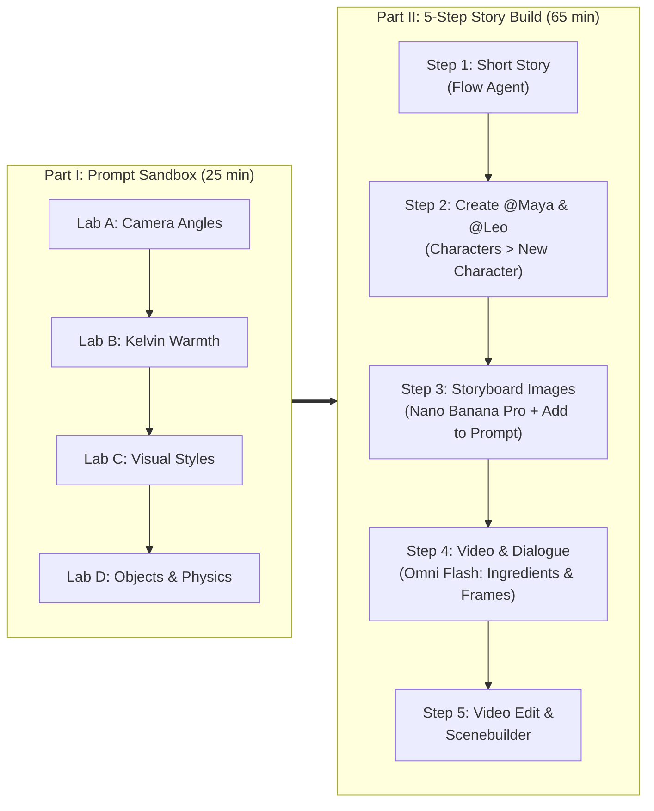

# Google Flow & Gemini Omni Storytelling Workshop

A hands-on workshop for building character-consistent, story-driven video commercials inside **[Google Flow](https://labs.google/fx/tools/flow)** powered by **Gemini Omni Flash** and **Nano Banana Pro**.

---

## ✨ Key Workshop Highlights

- **100% Real Google Flow Workspace**: Every lab runs directly in [Google Flow](https://labs.google/fx/tools/flow) using **Google Flow Agent**, **Characters (`@Maya`, `@Leo`)**, **`More > Add to Prompt`**, **`Video > Ingredients`**, **`Video > Frames` (`+ Add start/end frame`)**, **`Save frame`**, **Omni Flash Video Editing**, and **Scenebuilder**.
- **Part I — Prompt Sandbox (Labs A–D)**: Test isolated creative levers—extreme camera angles, Kelvin lighting warmth, visual styles (`35mm Film`, `12fps Stop-Motion Clay`, `Watercolor`), and multi-object physics—before starting a production.
- **Part II — 5-Step Incremental Story Build**: Start from a 2-sentence story seed (*"Solis Artisan Coffee — The 6:00 AM Spark"*) and build a complete 30-second commercial step by step.
- **Proper `@Character` Consistency (`Create Once -> Refer by @Name`)**: Create **`@Maya`** and **`@Leo`** once in **Characters $\rightarrow$ New Character** (with bundled voices), then simply reference **`@Maya`** and **`@Leo`** in every scene prompt (e.g., `"@Maya drinks coffee from the terracotta cup"`) without re-generating their appearance.
- **Gemini Omni Flash Video Workflow**: Animate `4s–10s` clips with `@Character` tags and reference images (`More > Add to Prompt`), interpolate between **Start & End Frames**, prototype in **Omni 360p** and upscale to **720p for 0 credits**, and refine clips with **3-turn conversational video editing**.

---

## 🗺️ Two-Part Workshop Structure

---

## 📂 Repository Contents

| Path | Description |
| :--- | :--- |
| **[`prompts/00-atomic-prompt-sandbox.md`](prompts/00-atomic-prompt-sandbox.md)** | **Part I**: 4 Google Flow Sandbox Labs (Camera Angles, Warmth, Visual Styles, Multi-Object Physics & Kinetic Text). |
| **[`prompts/solis-commercial-prompt-library.md`](prompts/solis-commercial-prompt-library.md)** | **Part II**: Copy-paste prompts for *"Solis — The 6:00 AM Spark"* using `@Maya`, `@Leo`, `More > Add to Prompt`, and `Video > Frames`. |
| **[`prompts/bonus-story-packs.md`](prompts/bonus-story-packs.md)** | Two bonus Google Flow commercial packs (*NovaPay Fintech* and *Kuntur Outdoor Gear*). |
| **[`workshop-guide/01-instructor-playbook.md`](workshop-guide/01-instructor-playbook.md)** | 90-minute facilitator run-of-show and live demo callouts. |
| **[`workshop-guide/02-student-incremental-labs.md`](workshop-guide/02-student-incremental-labs.md)** | Step-by-step student lab guide for Google Flow. |
| **[`workshop-guide/03-google-flow-cheatsheet.md`](workshop-guide/03-google-flow-cheatsheet.md)** | Single-page reference for `@Character`, `More > Add to Prompt`, `Video > Frames`, `Save frame`, `Omni 360p -> 720p`, and `Scenebuilder`. |
| **[`slides/`](slides/README.md)** | 14-slide Google Slides deck generator ([`build_flow_workshop_deck.py`](slides/build_flow_workshop_deck.py)) and PDF export ([`google-flow-storytelling-workshop-slides.pdf`](slides/google-flow-storytelling-workshop-slides.pdf)). |
| **[`docs/index.html`](docs/index.html)** | Interactive web companion with one-click prompt copy buttons. |

---

## 🚀 Quick Start

1. Open **[Google Flow](https://labs.google/fx/tools/flow)** and click **+ New Project**.
2. Follow **[`prompts/00-atomic-prompt-sandbox.md`](prompts/00-atomic-prompt-sandbox.md)** to test isolated camera, lighting, style, and physics prompts in **Nano Banana Pro** and **Omni Flash**.
3. Open **[`workshop-guide/02-student-incremental-labs.md`](workshop-guide/02-student-incremental-labs.md)** to create **`@Maya`** and **`@Leo`** once in **Characters $\rightarrow$ New Character** and build the 5-shot *"Solis"* commercial in **Omni Flash** and **Scenebuilder**.
