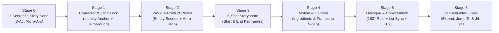

# Facilitator Playbook: Google Flow & GenMedia Incremental Storytelling Workshop

> **Target Duration**: 90–120 Minutes (Hands-On Workshop)  
> **Primary Workspace**: [Google Flow](https://labs.google/fx/tools/flow) (`labs.google/fx/tools/flow` or Enterprise `flow.cloud.google.com`)  
> **Cross-Platform Compatibility**: [Google AI Studio](https://aistudio.google.com), Vertex AI GenMedia Creative Studio, Runway Gen-4, Midjourney, Luma Dream Machine, Kling  
> **Core Models**: `gemini-3.8-flash` (Story & Storyboard), `gemini-3.1-flash-image` / `gemini-3-pro-image` (Nano Banana 2 / Pro — Character & Scene Ingredients), `veo-3.1` & `gemini-omni-1.1-flash` (Video & Native Dialogue), `gemini-3.8-flash-tts` (Expressive Voiceover), `lyria-3` (Musical Score)

---

## 1. Pedagogical Philosophy: Why "The Layer-Cake (Snowball) Method"?

When beginners open a generative video tool, their instinct is to type a single massive prompt:
> *"Make a 30-second commercial about a tired architect who walks into a coffee shop in the rain, talks to a friendly barista, drinks coffee, and gets inspired to draw a skyscraper."*

**Why that fails on every platform:**
1. **Single-Clip Temporal Ceiling**: Video models generate 4-to-8-second shots, not 30-second multi-location edits.
2. **Character & Face Drift**: Without locked reference assets and a repeatable verbal identity anchor, the protagonist's face, glasses, hair, and clothing mutate in every shot.
3. **Set & Product Hallucination**: The coffee cup changes color, the café counter flips sides, and the rain disappears mid-scene.
4. **Broken Eyelines in Conversation**: When two characters speak, random camera angles make them look in the same direction (away from each other) rather than across a shared axis.

### The Incremental Solution
In this workshop, participants start with a **2-sentence micro-story** and **pile on one production layer at a time**:

---

## 2. Master Run-of-Show & Timing Table (105 Minutes)

| Time | Stage | Module Focus | Live Demo Action (Instructor) | Participant Hands-On Output |
| :--- | :-: | :--- | :--- | :--- |
| `00:00–00:10` | **Intro** | The Crisis of "One-Prompt Video" | Show a drifted 3-clip failure vs. the finished **"Solis — The 6:00 AM Spark"** commercial. | Open Google Flow (or fallback platform) and create project `Solis-Ad`. |
| `00:10–00:20` | **Stage 0** | **The Micro-Story Seed** | Expand a 2-sentence logline into a 3-Act emotional beat sheet using `gemini-3.8-flash`. | Generate a 3-Act micro-story with 2 characters, 2 locations, and 1 hero prop. |
| `00:20–00:40` | **Stage 1** | **Character & Face Consistency** | Create `[CHAR_MAYA]` and `[CHAR_LEO]` in Flow's **Ingredients Panel** + build the 4-Angle Turnaround Sheet. | Pin 2 Character Ingredients + write verbatim 35-word Identity Anchor Blocks. |
| `00:40–00:55` | **Stage 2** | **Scene & Product Generation** | Generate empty Location Plates (`[SCENE_STUDIO]`, `[SCENE_CAFE]`) and `[PROP_CUP]` (`SOLIS` terracotta cup). | Pin 2 Location Ingredients + 1 Hero Product Ingredient (zero actors in scenes). |
| `00:55–01:10` | **Stage 3** | **Storyboarding & Keyframe Pairs** | Composite Characters + Scenes + Prop into 6 Storyboard Keyframes (including Start/End frame pairs). | Generate the 6-Shot Storyboard Grid and verify visual continuity before video rendering. |
| `01:10–01:25` | **Stage 4** | **Motion & Camera Directing** | Animate Shot 1 via **Ingredients to Video** (dolly-in) and Shot 3 via **Frames to Video** (First/Last frame macro). | Render Shots 1–3 as 6–8s video clips with explicit lens & camera movement controls. |
| `01:25–01:40` | **Stage 5** | **Dialogue & Conversation** | Direct Shots 4 & 5 (Leo & Maya's conversation) using the **180-Degree Rule**, Veo 3.1 native lip-sync, and `gemini-3.8-flash-tts`. | Render a 2-character shot-reverse-shot conversation + brand voiceover & `lyria-3` score. |
| `01:40–01:55` | **Stage 6** | **Scenebuilder Assembly** | Sequence Shots 1–6 in **Scenebuilder**, demonstrate **`Extend`** and **`Jump To`**, and apply J/L audio cuts. | Assemble and export the final 30-second commercial. |

---

## 3. Stage-by-Stage Facilitator Script & Live Demo Checkpoints

### Stage 0: Starting Small — The 2-Sentence Story Seed (10 Min)
* **Talking Point**: *"Great commercials don't start with camera lenses; they start with a contrast between two states. Before touching an image or video generator, we constrain our scope: 30 seconds, 2 characters, 2 locations, 1 hero product, and a clear emotional shift from cold isolation to warm inspiration."*
* **Live Action**:
  1. Paste **Prompt 0.1** into Gemini (`gemini-3.8-flash`) or Flow Agent.
  2. Highlight how the output separates **Act I (Cold Cyan Rain / Creative Block)**, **Act II (Warm Amber Café / Human Connection)**, and **Act III (Golden Sunrise / Spark Reignited)**.
* **Cross-Platform Note**: Emphasize that keeping the story beat sheet in plain text/JSON makes it 100% portable across any creative tool.

---

### Stage 1: Character Generation & Face Consistency (20 Min)
* **Talking Point**: *"Face consistency is the #1 question in AI filmmaking. Why do faces change between shots? Because users only upload an image OR only write a vague description like 'a young woman.' To achieve production-grade face lock, we combine **Visual Reference Conditioning** (Ingredients) with a verbatim **35-Word Identity Anchor Block**."*
* **The 3 Golden Rules of Face Consistency**:
  1. **Specific Facial Landmarks**: Include skin tone, a distinct micro-feature (*"subtle freckles across the nose"*, *"warm crinkles around hazel eyes"*), exact hair parting/clip, and signature eyewear/wardrobe (*"round tortoiseshell glasses"*, *"oversized ochre knit cardigan"*).
  2. **Neutral Lighting on Reference Portraits**: Generate Character Ingredients against a clean, neutral 5600K studio backdrop (`85mm lens, f/2.0`). Never use heavy neon or colored shadows in your master character ingredient, or that lighting will bleed into daytime scenes.
  3. **The 4-Angle Turnaround Sheet (Cross-Platform Secret)**: With `gemini-3-pro-image` (Nano Banana Pro) or `gemini-3.1-flash-image` (Nano Banana 2), ask for a **4-panel character reference sheet** in one generation (Front, 45° Three-Quarter, Side Profile, Smiling Close-Up). Cropping those 4 panels gives you angle-matched reference inputs on any video platform!

---

### Stage 2: Scene & Product Ingredients — Building an Empty Stage (15 Min)
* **Talking Point**: *"Think like a film production designer: build the set before calling the actors onto the stage. If you generate a café with a random person already standing behind the counter, the video model will fight between that random person and your Character Ingredient."*
* **Live Action**:
  1. Run **Prompts 2.1 & 2.2** to generate empty Location Plates (`[SCENE_STUDIO]` and `[SCENE_CAFE]`). Point out the explicit phrase `"Empty chair"` / `"empty frame ready for characters"`.
  2. Run **Prompt 2.3** using `gemini-3-pro-image` (Nano Banana Pro) to generate `[PROP_CUP]` with crisp `"SOLIS"` typography embossed on matte terracotta ceramic.

---

### Stage 3: Storyboarding & Keyframe Continuity (20 Min)
* **Talking Point**: *"Video generation takes time and compute credits. Image generation takes seconds. Professional AI directors never guess in video—they lock composition, lighting, and character placement in a **6-Shot Storyboard Grid** first."*
* **Live Action**:
  1. Walk through the 6-Shot Storyboard table.
  2. Show how **Shot 3** and **Shot 6** use **Paired Keyframes (Start Frame + End Frame)** so we can control exactly where the camera starts and where it lands using Google Flow's **Frames to Video** mode.

---

### Stage 4: Motion, Camera Physics & Ingredients-to-Video (20 Min)
* **Talking Point**: *"Now that our visual ingredients and storyboard frames are locked, our video prompt no longer has to invent what the room or character looks like—it can dedicate 100% of its attention to **camera movement, physical motion, and timing**."*
* **When to use which mode in Google Flow**:
  - **Ingredients to Video** (Up to 3 reference images: Character + Scene + Prop): Best when you want natural, open-ended acting and camera movement within a consistent world (e.g., Shot 1, Shot 2, Shot 4, Shot 5).
  - **Frames to Video** (First Frame + Last Frame): Best when you need an exact start-to-finish camera move or state change (e.g., Shot 3 macro espresso pour sliding to foreground, or Shot 6 transition from setting the cup down to sketching the bridge).

---

### Stage 5: Pile On Dialogue, Conversation & Audio (20 Min)
* **Talking Point**: *"Now we reach the climax of the incremental build: two characters having a believable conversation. To make two generated clips feel like a real dialogue scene, you must obey a 100-year-old filmmaking law: **The 180-Degree Axis of Action**."*
* **Visualizing the 180-Degree Rule for AI Video**:
  - Draw an imaginary line connecting Maya (standing on the left of the café counter) and Leo (standing on the right of the café counter).
  - Keep the virtual camera on the **front side** of that line for both shots:
    - **Shot 4 (Leo speaks)**: Leo is on the **right side of the frame**, looking **screen-left** (`"looking screen-left toward Maya's shoulder"`).
    - **Shot 5 (Maya replies)**: Maya is on the **left side of the frame**, looking **screen-right** (`"looking screen-right toward the barista"`).
  - When cut together, their eyes meet across the cut!
* **Dialogue Formatting for Veo 3.1**:
  - Enclose spoken words in single quotes (`'...'`) directly after describing the character's vocal tone and facial expression:
    `Leo speaks in a warm, grounded baritone voice: 'Rough night with the blueprints? Start with this—the lines always follow.'`
  - Reinforce the spoken line in the `Audio:` block at the bottom of the prompt alongside ambient sound effects.
* **Expressive Voiceover with `gemini-3.8-flash-tts`**:
  - Demonstrate how to generate the final commercial narrator tagline (or dub external-platform clips) using `gemini-3.8-flash-tts` with expressive voices (`Kore`, `Charon`, `Aoede`, `Puck`, `Fenrir`) and affective markup tags (`[sigh]`, `[short pause]`).

---

### Stage 6: Scenebuilder Assembly, `Extend` & `Jump To` (15 Min)
* **Talking Point**: *"In our final 15 minutes, we move into Google Flow's **Scenebuilder** to assemble our 6 shots and test two specialized continuity tools: **`Extend`** and **`Jump To`**."*
* **Key Distinction**:
  - **`Extend`**: Analyses the final frames of an existing clip and continues the exact same shot/camera move for an additional 4–8 seconds (great for letting a reaction breathe).
  - **`Jump To`**: Transitions the character from the end of one clip into a brand-new environment or camera angle while carrying forward the visual context of the previous clip (great for the match-cut transition from the café back to Maya's sunlit studio in Shot 6).

---

## 4. Facilitator Troubleshooting Matrix (Live Workshop Rescue Guide)

| Symptom During Workshop | Root Cause | Immediate Fix (Google Flow & Cross-Platform) |
| :--- | :--- | :--- |
| **Character's face looks slightly different in Shot 5 vs. Shot 1** | Prompt omitted the verbal Identity Anchor Block, or the Character Ingredient had harsh colored shadows. | Re-paste the verbatim 35-word `[CHAR_MAYA]` Identity Anchor Block AND attach the neutral-lit 45° or Front panel from the Character Turnaround Sheet. |
| **Characters look the same way instead of at each other in Shots 4 & 5** | Prompt said *"looking at the camera"* or omitted screen-direction keywords. | Explicitly specify `"positioned on the right of the frame, looking screen-left"` for Character A, and `"positioned on the left of the frame, looking screen-right"` for Character B. |
| **Character talks too fast or lips stop moving mid-sentence** | Dialogue line exceeds ~12–15 words for a 6–8 second video clip. | Trim spoken dialogue to **8–12 words per 6–8s clip** (~2 words per second) and add a physical action beat before or after the line. |
| **Product logo (`SOLIS`) warps during fast camera motion** | Text-to-video generated the cup from scratch instead of anchoring on a reference frame. | Generate the hero product frame first with `gemini-3-pro-image` (Nano Banana Pro) and pass it as **First Frame** (or **Object Ingredient**) into **Frames to Video**. |
| **Cut between two clips feels robotic or abrupt** | Audio starts and stops at the exact millisecond of the visual cut. | Apply a **J-Cut** or **L-Cut**: overlap the ambient café rain/espresso audio or let the last 0.5s of Leo's voice trail over the visual cut to Maya's reaction shot. |
