# Facilitator Playbook: Google Flow & GenMedia Incremental Storytelling Workshop (Gemini Omni & Lyria 3.5 Edition)

> **Target Duration**: 110–120 Minutes (Two-Part Hands-On Workshop)  
> **Primary Workspace**: [Google Flow](https://labs.google/fx/tools/flow) (`labs.google/fx/tools/flow` or Enterprise `flow.cloud.google.com`) & [Google AI Studio](https://aistudio.google.com?model=gemini-omni-1.1-flash)  
> **Cross-Platform Compatibility**: Vertex AI Studio / Gemini Enterprise Agent Platform, Runway Gen-4, Midjourney, Luma Dream Machine, Kling  
> **Core Model Stack (Late 2026)**:
> - **Story & Director Agent**: `gemini-3.8-flash`
> - **Image Generation & Ingredients**: `gemini-3-pro-image` (*Nano Banana Pro*) & `gemini-3.1-flash-image` (*Nano Banana 2*)
> - **Primary Video Generation & Conversational Editing**: **`gemini-omni-1.1-flash`** (*Gemini Omni Flash* / `omni`) — Multi-input references (up to 5 images + 3 videos), multi-turn conversational editing, First & Last Frame keyframing, 10s scene extension (up to 40s), 360p draft -> 4K upscaling, kinetic typography sync, and native audio
> - **Complementary Video Engine**: `veo-3.1-generate-preview` (*Veo 3.1*)
> - **Expressive Voiceover & Acting**: `gemini-3.8-flash-tts` (`Kore`, `Charon`, `Aoede`, `Puck`, `Fenrir`)
> - **Multimodal Music & Scoring**: **`lyria-3.5`**, **`lyria-3-pro-preview`**, and **`lyria-3-clip-preview`** (44.1 kHz stereo from Text or Image + Text)

---

## 1. Two-Part Pedagogical Philosophy: "Atomic Sandbox First, Layer-Cake Production Second"

Why do most generative video workshops overwhelm participants? Because they ask students to control **story, character likeness, camera angles, lighting warmth, style, physics, and dialogue all in the very first prompt**.

To build true mastery, this workshop is structured into **Two Parts**:

1. **Part I — The Atomic Prompt Mastery Sandbox (`prompts/00-atomic-prompt-sandbox.md`, 20 Min)**:
   - Before building a multi-shot commercial (or as a pre-work / warm-up lab), participants test **amazing prompts that push one isolated characteristic at a time** across **Image Generation (`gemini-3-pro-image`)** and **Video Generation (`gemini-omni-1.1-flash`)**:
     - **Lab A**: Extreme Camera Angles & Single-Take Whip-Pan Choreography (+ Conversational Angle Edit)
     - **Lab B**: Warmth, Kelvin Color Temperature (`7500K` Cold Blue vs. `2400K` Golden Sunrise) & Conversational Relighting
     - **Lab C**: Radical Aesthetic & Film Stock Styles (35mm Kodak 500T, Stop-Motion Clay/Felt at 12fps, Sumi-e Watercolor, 1999 Y2K Broadcast)
     - **Lab D**: Multi-Object Spatial Lock (5 objects) & Chain-Reaction Fluid Physics
     - **Lab E**: Gemini Omni Exclusive Superpowers (In-Video Kinetic Typography + Multi-Turn Conversational Video Editing)
     - **Lab F**: Latest **Lyria 3.5** Multimodal Music Lab (Text + Image -> 44.1 kHz Stereo Score)
2. **Part II — The 7-Stage Incremental Commercial Production (`workshop-guide/02-student-incremental-labs.md`, 95 Min)**:
   - Armed with atomic prompting mastery, participants start from a **2-sentence story seed** (**"Solis — The 6:00 AM Spark"**) and incrementally pile on **Character Face Lock**, **Empty Location Plates**, **6-Shot Storyboards**, **Gemini Omni Video Generation**, **Two-Character Dialogue**, **Lyria 3.5 Scoring**, and **Conversational Editing / Scenebuilder Assembly**.

```mermaid
flowchart LR
    P1["Part I: Atomic Sandbox<br/>(Angles, Warmth, Styles,<br/>Objects, Omni Edit, Lyria 3.5)"] ==> S0["Stage 0<br/>2-Sentence Story Seed<br/>(gemini-3.8-flash)"]
    S0 --> S1["Stage 1<br/>Character & Face Lock<br/>(Identity Anchor + 4-Angle)"]
    S1 --> S2["Stage 2<br/>World & Product Plates<br/>(Empty Sets + SOLIS Cup)"]
    S2 --> S3["Stage 3<br/>6-Shot Storyboard<br/>(Start & End Keyframes)"]
    S3 --> S4["Stage 4<br/>Gemini Omni Video<br/>(Multi-Ref & Keyframes)"]
    S4 --> S5["Stage 5<br/>Dialogue & Lyria 3.5<br/>(180° Rule + TTS + Score)"]
    S5 --> S6["Stage 6<br/>Omni Conversational Edit<br/>& Scenebuilder (Up to 40s)"]
```

---

## 2. Master Run-of-Show & Timing Table (115 Minutes)

| Time | Section / Stage | Module Focus | Live Demo Action (Instructor) | Participant Hands-On Output |
| :--- | :-: | :--- | :--- | :--- |
| `00:00–00:08` | **Intro** | Why "One Giant Prompt" Fails | Contrast a drifted single-prompt clip against the finished **"Solis"** commercial & introduce **Gemini Omni 1.1 Flash**. | Open Google Flow & AI Studio (`gemini-omni-1.1-flash`). |
| `00:08–00:28` | **Part I** | **Atomic Prompt Mastery Sandbox** | Live A/B test of isolated variables: Worm's-Eye vs. Overhead, 7500K vs. 2400K relighting in `gemini-omni-1.1-flash`, 5-object composition, and `lyria-3.5` image-to-music. | Run 3–4 atomic prompts from [`00-atomic-prompt-sandbox.md`](../prompts/00-atomic-prompt-sandbox.md) + 1 conversational video edit. |
| `00:28–00:38` | **Stage 0** | **The Micro-Story Seed** | Expand a 2-sentence logline into a 3-Act emotional beat sheet using `gemini-3.8-flash`. | Generate a 3-Act micro-story with 2 characters, 2 locations, and 1 hero prop. |
| `00:38–00:53` | **Stage 1** | **Character & Face Consistency** | Create `[CHAR_MAYA]` and `[CHAR_LEO]` in Flow's **Ingredients Panel** + build the 4-Angle Turnaround Sheet in `gemini-3-pro-image`. | Pin 2 Character Ingredients + lock verbatim 35-word Identity Anchor Blocks. |
| `00:53–01:05` | **Stage 2** | **Scene & Product Generation** | Generate actor-free Location Plates (`[SCENE_STUDIO]`, `[SCENE_CAFE]`) and `[PROP_CUP]` (`SOLIS` terracotta cup). | Pin 2 Location Ingredients + 1 Hero Product Ingredient. |
| `01:05–01:18` | **Stage 3** | **Storyboarding & Keyframe Pairs** | Composite Characters + Scenes + Prop into 6 Storyboard Keyframes (including Start/End frame pairs). | Generate the 6-Shot Storyboard Grid and verify visual continuity before video rendering. |
| `01:18–01:35` | **Stage 4** | **Gemini Omni Video Directing** | Animate Shots 1–3 in **`gemini-omni-1.1-flash`**: Multi-Reference Video, First/Last Frame Keyframing, and 360p Draft -> 4K Upscaling. | Render Shots 1–3 in `gemini-omni-1.1-flash` (or Flow `Ingredients/Frames to Video`). |
| `01:35–01:55` | **Stage 5** | **Dialogue & Lyria 3.5 Scoring** | Direct Shots 4 & 5 (Leo & Maya's conversation) using the **180° Rule**, Gemini Omni native lip-sync, `gemini-3.8-flash-tts`, and **`lyria-3.5`**. | Render a 2-character shot-reverse-shot conversation + TTS voiceover + 44.1 kHz `lyria-3.5` score. |
| `01:55–02:10` | **Stage 6** | **Omni Conversational Edit & Scenebuilder** | Refine clips via **Gemini Omni multi-turn conversational editing**, extend scenes up to 40s (`10s increments`), and add kinetic text + J/L cuts. | Conversational-edit a take, extend Shot 5/6, and export the final 30-second commercial. |

---

## 3. Why Focus on Gemini Omni (`gemini-omni-1.1-flash`) for Video Generation?

### Key Instructor Talking Points (Gemini Omni 1.1 Flash vs. Legacy Video Pipelines)
1. **True Multimodal Reference Fusion (Up to 5 Images + 3 Videos Simultaneously)**:
   - While legacy models accept 1–3 still images, **`gemini-omni-1.1-flash`** accepts **text, up to 5 reference images, and up to 3 reference videos (3s each)** in a single generation call. You can pass `[CHAR_MAYA]`, `[CHAR_LEO]`, `[SCENE_CAFE]`, and `[PROP_CUP]` together while maintaining character, object, and style lock!
2. **Conversational Multi-Turn Video Editing (`Interactions API`)**:
   - In traditional video models, if a generated take is 85% right but the lighting is too cool or the camera angle is too wide, regenerating from scratch rolls the dice on everything.
   - With **`gemini-omni-1.1-flash`**, you simply reply in conversation:
     > *"Keep the exact character, action, and audio, but relight the room to warm 2400K golden sunrise and push the camera in to a closer medium shot."*
3. **First & Last Frame Keyframing (`Keyframe Interpolation`)**:
   - Anchor both the starting frame and ending frame of a clip (3s–10s in 1-second increments) to guarantee smooth camera orbits, zoom transitions, and crystal-clear product logo landings.
4. **360p Fast Prototyping -> 4K Production Upscaling**:
   - Iterate camera choreography rapidly at **360p ($0.034/s)** or **720p ($0.10/s)** during the workshop, then upscale the winning take to **1080p or 4K at 24fps**.
5. **10-Second Scene Extension (Up to 40 Seconds) & Kinetic Typography Sync**:
   - Extend clips in 3-to-10-second increments up to **40 seconds total**, and render legible on-screen kinetic text (`"SOLIS — AWAKEN THE CRAFT"`) that physically interacts with steam and lighting in the scene.

---

## 4. Stage-by-Stage Facilitator Script & Live Demo Checkpoints

### Part I: The Atomic Prompt Mastery Sandbox (20 Min)
* **Talking Point**: *"Before we build a house, let's test our tools on individual materials. Open [`prompts/00-atomic-prompt-sandbox.md`](../prompts/00-atomic-prompt-sandbox.md). For the next 20 minutes, we are going to push single, isolated variables to the extreme—first an extreme 14mm worm's-eye angle vs. a 90° overhead flat-lay; next, flipping a room from 7500K cold blue rain to 2400K golden warmth; then a 5-object spatial lock, a Rube Goldberg physics chain reaction in `gemini-omni-1.1-flash`, a conversational relight edit, and an image-to-music score in `lyria-3.5`."*
* **Live Action**:
  1. Run **Prompts B.1 & B.2** side-by-side to show how Kelvin color temperature alone tells an emotional story.
  2. Run **Prompt A.3** in `gemini-omni-1.1-flash` (continuous whip-pan & crane-up), then run **Prompt A.4** as a conversational follow-up turn to change the camera angle without losing the scene.
  3. Pass the warm sunrise image from **B.2** into **`lyria-3.5`** (**Prompt F.3**) to generate a 44.1 kHz stereo soundtrack directly from the image!

---

### Stage 0: Starting Small — The 2-Sentence Story Seed (10 Min)
* **Talking Point**: *"Now that we know how to control individual levers, we start Part II: our incremental commercial production. We constrain our scope: 30 seconds, 2 characters, 2 locations, 1 hero product, and a clear lighting arc from 7500K cold isolation to 2400K warm inspiration."*
* **Live Action**: Paste **Prompt 0.1** into `gemini-3.8-flash` or Flow Agent to generate the 3-Act beat sheet.

---

### Stage 1: Character Generation & Face Consistency (15 Min)
* **The 3 Golden Rules of Face Consistency**:
  1. **35-Word Identity Anchor Block**: Lock skin tone, micro-feature (*"subtle freckles across the nose"*, *"warm crinkles around hazel eyes"*), exact hair clip, and signature accessories (*"round tortoiseshell glasses"*, *"oversized ochre knit cardigan"*).
  2. **Neutral 5600K Studio Reference Portrait**: Generate Character Ingredients (`[CHAR_MAYA]`, `[CHAR_LEO]`) on a neutral grey backdrop so colored shadows never contaminate later scenes.
  3. **The 4-Angle Turnaround Sheet**: Generate Front, 45°, Side Profile, and Smiling Close-Up in one `gemini-3-pro-image` frame so you can pass angle-matched references into `gemini-omni-1.1-flash`.

---

### Stage 2: Scene & Product Ingredients — Building an Empty Stage (12 Min)
* **Live Action**:
  1. Run **Prompts 2.1 & 2.2** to generate actor-free Location Plates (`[SCENE_STUDIO]` and `[SCENE_CAFE]`). Point out `"Empty chair, no people"`.
  2. Run **Prompt 2.3** in `gemini-3-pro-image` (Nano Banana Pro) to generate `[PROP_CUP]` with crisp gold `"SOLIS"` typography on matte terracotta.

---

### Stage 3: Storyboarding & Keyframe Continuity (12 Min)
* **Live Action**:
  1. Generate the 6 Storyboard Keyframes combining Character + Scene + Prop ingredients.
  2. Highlight how **Shot 3** and **Shot 6** use **First Frame + Last Frame pairs** for deterministic keyframe interpolation in `gemini-omni-1.1-flash` (and Flow's `Frames to Video`).

---

### Stage 4: Animating with Gemini Omni 1.1 Flash (`gemini-omni-1.1-flash`) (18 Min)
* **Live Action**:
  1. **Multi-Reference Video (Shots 1 & 2)**: Pass `[CHAR_MAYA]` + `[SCENE_STUDIO]` into `gemini-omni-1.1-flash` (360p/720p fast draft first, then 1080p/4K).
  2. **First & Last Frame Keyframing (Shot 3)**: Pass Keyframe 3.3A (First Frame: espresso pour) and Keyframe 3.3B (Last Frame: Leo sliding the SOLIS cup to foreground) into `gemini-omni-1.1-flash` (or Flow's `Frames to Video`).
  3. **Conversational Fine-Tuning**: Show how a 1-sentence follow-up turn in `gemini-omni-1.1-flash` adjusts steam density or camera speed while preserving the take.

---

### Stage 5: Two-Character Dialogue, `gemini-3.8-flash-tts` & Latest `lyria-3.5` Score (20 Min)
* **The 180-Degree Rule for Shot-Reverse-Shot**:
  - **Shot 4 (Leo speaks)**: Leo is on the **right of the frame**, looking **screen-left** over Maya's ochre shoulder.
  - **Shot 5 (Maya replies)**: Maya is on the **left of the frame**, looking **screen-right** toward Leo.
  - Because `gemini-omni-1.1-flash` supports up to 5 image references, you can attach `[CHAR_LEO]`, `[CHAR_MAYA]`, `[SCENE_CAFE]`, and `[PROP_CUP]` simultaneously!
* **Upgraded Audio & Music Stack**:
  1. **Native Lip-Sync Dialogue (`gemini-omni-1.1-flash` / `veo-3.1`)**: Keep spoken dialogue to 8–12 words per 6–8s clip in single quotes.
  2. **Studio Voiceover (`gemini-3.8-flash-tts`)**: Generate the final commercial tagline using expressive voice `Kore` with affective tags (`[sigh]`, `[short pause]`).
  3. **Latest Lyria Music (`lyria-3.5` / `lyria-3-pro-preview` / `lyria-3-clip-preview`)**: Generate a 44.1 kHz stereo score using **Text + Keyframe Image** input (`lyria-3.5`) or a locked 30-second commercial bed (`lyria-3-clip-preview`).

---

### Stage 6: Conversational Video Editing, 10s Scene Extension & Scenebuilder Finale (15 Min)
* **Live Action**:
  1. **Gemini Omni Conversational Edit**: Take Shot 5 or Shot 6 and perform a multi-turn conversational edit (e.g., adding kinetic typography `"SOLIS — AWAKEN THE CRAFT"` synced to the rising coffee steam).
  2. **Scene Extension (`Extend` up to 40s)**: Use `gemini-omni-1.1-flash` 3–10s scene extension (or Flow Scenebuilder `Extend` and `Jump To`) to lengthen Maya's reaction and bridge her back to the sunlit studio.
  3. **J-Cut / L-Cut Audio Polish**: Trail the last 0.5s of Leo's voice over the visual cut to Shot 6 as Maya's charcoal pencil sweeps the bridge arch.

---

## 5. Facilitator Troubleshooting Matrix (Live Workshop Rescue Guide)

| Symptom During Workshop | Root Cause | Immediate Fix (`gemini-omni-1.1-flash` & Google Flow) |
| :--- | :--- | :--- |
| **Take is 85% great, but lighting or camera angle is slightly off** | Regenerating from scratch with a modified prompt changes the actor's performance. | Use **Gemini Omni Conversational Editing** (`previous_interaction_id` or multi-turn chat): *"Keep the exact performance and audio, but warm the lighting to 2700K golden hour."* |
| **Character's face drifts between Shot 1 and Shot 5** | Prompt omitted the 35-word Identity Anchor Block or used a shadowy reference image. | Re-paste the verbatim 35-word `[CHAR_MAYA]` Identity Anchor Block AND attach the neutral 5600K panel from the 4-Angle Turnaround Sheet. |
| **Characters look away from each other in Shots 4 & 5** | Prompt omitted explicit screen-direction gaze vectors. | Specify `"on the right of the frame, looking screen-left"` for Leo (Shot 4) and `"on the left of the frame, looking screen-right"` for Maya (Shot 5). |
| **Video iteration feels slow during live experimentation** | Generating every test take at full 1080p/4K resolution. | Prototype camera moves in **`gemini-omni-1.1-flash` 360p draft mode** (`$0.034/s`), then upscale only the winning take to 1080p or 4K. |
| **Music track doesn't match the visual transition at 0:08 and 0:20** | Generic 1-line music prompt without structural timestamps or visual grounding. | Use **`lyria-3.5`** with explicit `[0:00–0:08 Intro]`, `[0:08–0:20 Groove]`, `[0:20–0:30 Crescendo]` tags AND pass Keyframe 3.3 as an image input! |
