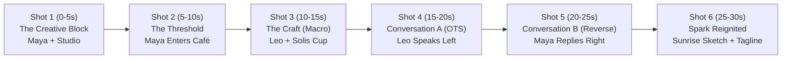

# Participant Hands-On Workbook: Incremental Storytelling in Google Flow & GenMedia

Welcome to the **Google Flow & GenMedia Incremental Storytelling Workshop**!

In this hands-on lab, you will produce a complete **30-second cinematic commercial** (**"Solis Artisan Coffee — The 6:00 AM Spark"**) using the **Incremental Layer-Cake ("Snowball") Method**. Instead of fighting a single giant prompt, you will start with a **2-sentence story seed** and progressively pile on:

1. **Stage 0**: The 2-Sentence Micro-Story Seed & 3-Act Beat Sheet
2. **Stage 1**: Character Generation & Strict Face Consistency (`[CHAR_MAYA]` & `[CHAR_LEO]`)
3. **Stage 2**: Scene & Product World Generation (`[SCENE_STUDIO]`, `[SCENE_CAFE]`, `[PROP_CUP]`)
4. **Stage 3**: 6-Shot Visual Storyboard & Start/End Keyframe Pairs
5. **Stage 4**: Motion, Camera Directing & Ingredients/Frames-to-Video
6. **Stage 5**: Two-Character Conversation, Lip-Sync Dialogue & Expressive Audio
7. **Stage 6**: Scenebuilder Timeline Assembly (`Extend`, `Jump To` & J/L Cuts)

> **Works Everywhere**: Every lab step includes **Track A (Google Flow Workspace)** and **Track B (Universal Cross-Platform Execution)** so you can run the exact same workflow in **Google Flow** (`labs.google/fx/tools/flow` or `flow.cloud.google.com`), **Google AI Studio / Vertex AI GenMedia Creative Studio**, or third-party tools (**Runway Gen-4**, **Midjourney**, **Luma**, **Kling**).

---

## Stage 0: Start with a Very Short Story (The Seed)

### What We Are Piling On
Before generating a single pixel, we establish a **2-sentence story seed** and expand it into a **3-Act Micro-Story** bounded by:
- **2 Characters**: **Maya** (an exhausted 29-year-old architect) and **Leo** (a warm 45-year-old neighborhood barista).
- **2 Locations**: Maya's **cold, rain-streaked studio desk at 5:45 AM** and Leo's **golden, steam-filled corner espresso bar at dawn**.
- **1 Hero Product**: The **matte terracotta `SOLIS` espresso cup**.

### Copy-Paste Prompt 0.1 — Story Seed to 3-Act Beat Sheet

#### English Prompt
```text
Act as a Commercial Film Director. I have a two-sentence story seed for a 30-second brand commercial for "Solis Artisan Coffee":
"At 5:45 AM in a rainy city, an exhausted architect staring at a blank blueprint steps into a glowing corner café. One shared laugh and a warm terracotta cup of espresso reignite her creative spark."

Expand this seed into a tight 3-Act Micro-Story:
- Act I (0:00-0:08): The Creative Block (Cold cyan rain, blank blueprint, exhaustion)
- Act II (0:08-0:22): The Warm Encounter (Stepping into the golden café, barista craft, a brief 2-line conversation that shifts her mood)
- Act III (0:22-0:30): The Spark Reignited (Back at the studio desk at sunrise, bold architectural sketch, brand tagline)

Keep it grounded in two characters (Maya, the architect; Leo, the barista), two locations, and one hero prop (the matte terracotta Solis cup). Focus on emotional beats and visual lighting contrast.
```

#### Prompt en Español (Opcional)
```text
Actúa como Director de Cine Publicitario. Tengo una semilla de historia de dos oraciones para un comercial de 30 segundos de "Solis Artisan Coffee":
"A las 5:45 AM en una ciudad lluviosa, una arquitecta agotada frente a un plano en blanco entra en una cafetería iluminada en la esquina. Una sonrisa compartida y una taza de cerámica terracota de espresso reavivan su chispa creativa."

Expande esta semilla en una Micro-Historia en 3 Actos:
- Acto I (0:00-0:08): El Bloqueo Creativo (Lluvia fría azul cian, plano en blanco, cansancio)
- Acto II (0:08-0:22): El Encuentro Cálido (Entrada a la cafetería dorada, preparación del café, breve conversación de 2 líneas que transforma su ánimo)
- Acto III (0:22-0:30): La Chispa Encendida (De vuelta al estudio al amanecer, trazo arquitectónico audaz, eslogan de marca)

Limita el universo a dos personajes (Maya, la arquitecta; Leo, el barista), dos locaciones y un objeto protagonista (la taza terracota mate de Solis).
```

### How to Execute
* **Track A (Google Flow)**: Open the **Flow Agent / Prompt Assistant** (or [Google AI Studio](https://aistudio.google.com) with `gemini-3.8-flash`) and run **Prompt 0.1**.
* **Track B (Other Platforms)**: Run **Prompt 0.1** in any LLM to lock your 3-act narrative bible before generating visuals.

---

## Stage 1: Pile On Character Generation & Face Consistency

### What We Are Piling On
Now we give faces to **Maya** and **Leo**—and make sure their faces **never drift** across shots. You will use a two-part lock:
1. **The Verbal "Identity Anchor Block"**: A 35-word description of facial geometry, skin tone, hair, eyewear, and wardrobe that you will copy-paste verbatim into every shot featuring that character.
2. **Visual Character Ingredients / 4-Angle Turnaround Sheet**: High-resolution studio portraits generated under neutral 5600K light (`gemini-3-pro-image` / Nano Banana Pro or `gemini-3.1-flash-image` / Nano Banana 2).

### Your Reusable Identity Anchor Blocks (Save These!)
* **`[CHAR_MAYA]`**:
  > `Maya, a 29-year-old Latina architect with warm olive skin, subtle freckles across the nose, expressive dark brown eyes, shoulder-length wavy raven hair tied in a loose low clip, wearing an oversized ochre knit cardigan over a white crew-neck tee and round tortoiseshell glasses`
* **`[CHAR_LEO]`**:
  > `Leo, a 45-year-old artisanal barista with a neatly trimmed salt-and-pepper beard, warm crinkles around hazel eyes, wearing a charcoal linen apron over a rolled-sleeve chambray shirt`

### Copy-Paste Prompt 1.1 — Protagonist Master Ingredient (`[CHAR_MAYA]`)
```text
Photorealistic cinematic portrait of Maya, a 29-year-old Latina architect with warm olive skin, subtle freckles across the nose, expressive dark brown eyes, shoulder-length wavy raven hair tied in a loose low clip, wearing an oversized ochre knit cardigan over a white crew-neck tee and round tortoiseshell glasses. Neutral studio backdrop with soft 5600K key light, 85mm prime lens, f/2.0, natural skin texture, zero retouching, front-facing three-quarter angle, calm neutral expression, no text, no watermark.
```

### Copy-Paste Prompt 1.2 — 4-Angle Face Consistency Turnaround Sheet (`[CHAR_MAYA_SHEET]`)
```text
A 4-panel character reference sheet on a clean neutral grey background showing the exact same woman in four views:
(1) Front view with a calm neutral expression,
(2) 45-degree three-quarter view with a tired late-night sigh,
(3) Side profile looking down thoughtfully at a desk,
(4) Front close-up with a warm, genuine smile and eyes lighting up.
Subject: Maya, a 29-year-old Latina architect with warm olive skin, subtle freckles across the nose, expressive dark brown eyes, shoulder-length wavy raven hair tied in a loose low clip, wearing an oversized ochre knit cardigan over a white crew-neck tee and round tortoiseshell glasses. Identical facial bone structure and glasses across all four panels, 85mm portrait photography, no text, no labels.
```

### Copy-Paste Prompt 1.3 — Co-Star Master Ingredient (`[CHAR_LEO]`)
```text
Photorealistic cinematic portrait of Leo, a 45-year-old artisanal barista with a neatly trimmed salt-and-pepper beard, warm crinkles around hazel eyes, wearing a charcoal linen apron over a rolled-sleeve chambray shirt. Neutral studio backdrop, soft warm key light, 85mm prime lens, f/2.2, natural skin pores, welcoming gentle smile, no text, no watermark.
```

### How to Execute
* **Track A (Google Flow Workspace)**:
  1. Open the **Ingredients** panel on the left sidebar of your Google Flow project.
  2. Click **Create Ingredient** (powered by Nano Banana Pro / Imagen) and run **Prompt 1.1** and **Prompt 1.3**.
  3. Pin both generated portraits as **Character Ingredients** (`Maya` and `Leo`).
* **Track B (Cross-Platform)**:
  1. Run **Prompt 1.2** in `gemini-3-pro-image` (or Midjourney / Flux) at `16:9` aspect ratio to get Maya's 4-panel turnaround sheet, plus **Prompt 1.3** for Leo.
  2. Crop the individual angles so you can attach the matching angle as a `reference_image` (or Character Reference `--cref` / Omni-Reference) for each shot.

---

## Stage 2: Pile On Scene & Product World Generation

### What We Are Piling On
Never generate your environment and your actors for the first time in the same prompt—if you do, the background architecture will mutate in every cut. Instead, generate **Empty Location Plates** (a stage with no actors) and a standalone **Hero Product Ingredient**.

### Copy-Paste Prompt 2.1 — Location Ingredient A: Cold Rainy Studio (`[SCENE_STUDIO]`)
```text
Wide establishing interior shot of a minimalist architect's loft desk by a tall rain-streaked industrial window at 5:45 AM before dawn. Empty chair, no people. A drafting lamp casts a cool cyan-blue pool of light over an unrolled blank blueprint, architectural scale ruler, and crumpled paper sketches. Raindrops trickle down the window glass with blurred city streetlights outside. Moody teal-and-slate color grade, 35mm anamorphic lens, shallow depth of field, cinematic realism, no text.
```

### Copy-Paste Prompt 2.2 — Location Ingredient B: Warm Corner Café (`[SCENE_CAFE]`)
```text
Medium-wide interior shot of a cozy, wood-paneled artisan espresso bar at dawn. Empty frame with no people. Warm amber Edison bulbs and a polished brass espresso machine gleam with gentle steam rising. Rain is visible outside the fogged front window, contrasting with the rich golden-hour warmth inside. Reclaimed oak counter in the foreground, 35mm cinema lens, Kodak Vision3 500T film look, no text.
```

### Copy-Paste Prompt 2.3 — Object Ingredient: The Hero Product (`[PROP_CUP]`)
```text
Macro studio product photograph of a handcrafted matte terracotta ceramic cappuccino cup resting on a matching terracotta saucer. A minimalist gold embossed sun emblem and the word "SOLIS" are printed cleanly on the front of the cup. Rich velvety hazelnut crema with delicate rosetta latte art on top, a wisp of steam rising. Soft warm rim lighting, neutral dark studio background, 100mm macro lens.
```

### How to Execute
* **Track A (Google Flow Workspace)**: Generate all three images in the **Ingredients** panel and pin them as `[SCENE_STUDIO]`, `[SCENE_CAFE]`, and `[PROP_CUP]`. You now have **5 reusable Ingredients** in your tray!
* **Track B (Cross-Platform)**: Generate all three images in `gemini-3-pro-image` (`Nano Banana Pro` excels at rendering the exact `"SOLIS"` gold embossed text on the cup) and save them to your `assets/` folder.

---

## Stage 3: Pile On the Visual Storyboard (6-Shot Keyframe Grid)

### What We Are Piling On
Before spending video generation time, we combine our **Characters (Stage 1)** + **Locations & Prop (Stage 2)** into **6 Storyboard Keyframes** that map out the entire 30-second commercial.



### Copy-Paste Storyboard Keyframe Prompts (Composite with Reference Images)

#### Keyframe 3.1 — Shot 1 Start Frame (`[CHAR_MAYA]` + `[SCENE_STUDIO]`)
```text
Using the character reference for Maya and the studio location reference: Medium close-up cinema still of Maya, a 29-year-old Latina architect with warm olive skin, subtle freckles, wavy raven hair in a low clip, round tortoiseshell glasses, and an ochre knit cardigan, sitting at the rain-streaked architect's desk at 5:45 AM. She rests her chin on her hand, staring at the blank blueprint with a tired, stuck expression. Cool cyan-blue pre-dawn window light reflects on her glasses. 35mm anamorphic lens.
```

#### Keyframe 3.2 — Shot 2 Start Frame (`[CHAR_MAYA]` + `[SCENE_CAFE]`)
```text
Using the character reference for Maya and the café location reference: Medium-wide cinema still of Maya stepping through the glass door of the cozy wood-paneled artisan café out of the cold blue rain. She folds a damp umbrella as warm amber light from the Edison bulbs washes over her face and ochre cardigan. 35mm cinema lens.
```

#### Keyframe 3.3 — Shot 3 Start & End Frame Pair (`[CHAR_LEO]` + `[PROP_CUP]` + `[SCENE_CAFE]`)
* **Shot 3 First Frame**:
  ```text
  Extreme close-up macro shot under the brass espresso portafilter in the warm café: rich dark espresso pouring in dual streams into the matte terracotta ceramic cup embossed with the gold "SOLIS" sun logo.
  ```
* **Shot 3 Last Frame**:
  ```text
  Foreground close-up on the reclaimed oak café counter: Barista Leo's hand (rolled-sleeve chambray shirt) gently slides the steaming matte terracotta "SOLIS" cappuccino cup with hazelnut latte art toward the camera. Warm golden rim lighting, shallow depth of field.
  ```

#### Keyframe 3.4 — Shot 4 Conversation Frame A (`[CHAR_LEO]` + `[CHAR_MAYA]` + `[SCENE_CAFE]`)
```text
Over-the-shoulder medium shot framed from behind Maya's ochre-cardigan shoulder on the far left, focusing on Leo, a 45-year-old barista with a neat salt-and-pepper beard and charcoal linen apron positioned on the right of the frame, looking screen-left toward Maya with a warm, encouraging smile, his hand resting near the steaming terracotta SOLIS cup on the oak counter. 50mm prime lens, shallow depth of field.
```

#### Keyframe 3.5 — Shot 5 Conversation Frame B (`[CHAR_MAYA]` + `[PROP_CUP]` + `[SCENE_CAFE]`)
```text
Reverse-angle medium close-up of Maya, a 29-year-old Latina architect with warm olive skin, round tortoiseshell glasses, and ochre knit cardigan positioned on the left of the frame, looking screen-right toward the barista. She wraps both hands around the warm terracotta SOLIS cup, inhaling the steam as her expression softens into a genuine, relieved smile. Warm golden key light, rainy window blurred behind her, 50mm prime lens.
```

#### Keyframe 3.6 — Shot 6 Start & End Frame Pair (`[CHAR_MAYA]` + `[PROP_CUP]` + `[SCENE_STUDIO]`)
* **Shot 6 First Frame**:
  ```text
  Medium close-up at the architect's loft desk as golden morning sunbeams break through the wet window, replacing the cold blue light. Maya sets the steaming terracotta SOLIS cup down next to her blank blueprint and picks up a charcoal drafting pencil with excited focus.
  ```
* **Shot 6 Last Frame**:
  ```text
  High-angle over-the-shoulder close-up of Maya's hand drawing a bold, sweeping suspension bridge arch across the blueprint in warm golden morning sunlight, with the matte terracotta SOLIS cup steaming beside the drawing.
  ```

---

## Stage 4: Pile On Motion & Camera Directing

### What We Are Piling On
Now we animate Shots 1, 2, and 3 using Google Flow's two core video modes (**Ingredients to Video** and **Frames to Video** powered by **Veo 3.1** / **Gemini Omni 1.1 Flash**).

### Copy-Paste Video Prompt 4.1 — Shot 1 ("Ingredients to Video")
* **Attach Ingredients**: `[CHAR_MAYA]` + `[SCENE_STUDIO]` (or pass **Keyframe 3.1** as start frame).
```text
Slow, smooth dolly-in toward a medium close-up of Maya, a 29-year-old Latina architect with warm olive skin, subtle freckles, wavy raven hair in a low clip, round tortoiseshell glasses, and an ochre knit cardigan, sitting at her drafting table by a rain-streaked window at 5:45 AM. She exhales a quiet sigh, taps her wooden pencil twice against the blank blueprint, and glances out at the rain. Cold cyan streetlamp reflections glide across her glasses. Shallow depth of field, 35mm anamorphic lens, subtle film grain.
Audio: Soft rhythmic rain pattering against window glass, distant low rumble of thunder, two crisp wooden pencil taps on paper, and a quiet sigh.
```

### Copy-Paste Video Prompt 4.2 — Shot 2 ("Ingredients to Video")
* **Attach Ingredients**: `[CHAR_MAYA]` + `[SCENE_CAFE]` (or pass **Keyframe 3.2** as start frame).
```text
Smooth lateral tracking shot following Maya, a 29-year-old Latina architect in her ochre knit cardigan and round tortoiseshell glasses, as she pushes open the glass café door from the rainy blue street and steps into the warm golden glow of the artisan espresso bar. A brass door chime rings softly as she shakes raindrops off her umbrella and looks toward the counter with relief. 35mm cinema lens, warm Kodak 500T color grade.
Audio: Rain sound fading as the wooden door closes, a warm brass shop bell chime, gentle espresso machine hiss, and cozy acoustic café ambiance.
```

### Copy-Paste Video Prompt 4.3 — Shot 3 ("Frames to Video" — Start + End Interpolation)
* **Set First Frame**: `Shot 3 First Frame` (Espresso pouring into `SOLIS` cup).
* **Set Last Frame**: `Shot 3 Last Frame` (Leo sliding the `SOLIS` cup across the oak counter).
```text
Macro cinematic tracking shot transitioning smoothly from the first frame to the last frame. Rich, syrupy espresso finishes pouring into the matte terracotta SOLIS cup, forming velvety hazelnut crema. Barista Leo's hand gently lifts the cup from the machine, places it onto the reclaimed oak counter, and slides it smoothly toward the foreground camera as a wisp of golden steam curls upward. 100mm macro cinema lens, 60fps slow-motion feel.
Audio: Rich espresso extraction hiss, gentle ceramic clink on oak wood, warm fingerpicked acoustic guitar notes entering softly.
```

---

## Stage 5: Pile On Dialogue, Conversation & Audio

### What We Are Piling On
Now we add **spoken dialogue** and a **two-character conversation** across Shots 4 and 5!
To make Leo and Maya look directly at each other across the counter edit:
- **Shot 4 (Leo)**: Positioned on the **right**, looking **screen-left**, speaking in a warm baritone.
- **Shot 5 (Maya)**: Positioned on the **left**, looking **screen-right**, smiling and replying.

### Copy-Paste Video Prompt 5.1 — Shot 4: Leo Speaks ("Ingredients to Video" + Native Dialogue)
* **Attach Ingredients**: `[CHAR_LEO]` + `[SCENE_CAFE]` + `[PROP_CUP]` (or **Keyframe 3.4**).
```text
Over-the-shoulder medium shot framed from behind Maya's ochre-cardigan shoulder on the left, focusing on Leo, a 45-year-old barista with a neat salt-and-pepper beard and charcoal linen apron positioned on the right of the frame, looking screen-left with a warm, knowing smile. As his hand rests beside the steaming terracotta SOLIS cup on the counter, Leo speaks clearly in a warm, grounded baritone voice: 'Rough night with the blueprints? Start with this—the lines always follow.' Warm amber café lighting, 50mm prime lens, natural lip synchronization.
Audio: Cozy café ambiance, soft rain outside, and Leo speaking in a warm baritone voice: 'Rough night with the blueprints? Start with this—the lines always follow.'
```

### Copy-Paste Video Prompt 5.2 — Shot 5: Maya Replies ("Ingredients to Video" + Native Dialogue)
* **Attach Ingredients**: `[CHAR_MAYA]` + `[SCENE_CAFE]` + `[PROP_CUP]` (or **Keyframe 3.5**).
```text
Reverse-angle medium close-up of Maya, a 29-year-old Latina architect with warm olive skin, round tortoiseshell glasses, and ochre knit cardigan positioned on the left of the frame, looking screen-right toward the barista. She wraps both hands around the warm terracotta SOLIS cup, inhales the rising steam, and her tired expression melts into a genuine, relieved smile. She replies softly with a light chuckle: 'You just saved the whole skyline, Leo.' Warm golden key light on her face, 50mm prime lens, natural lip synchronization.
Audio: Gentle café murmur and Maya speaking in a warm, relieved voice with a subtle laugh: 'You just saved the whole skyline, Leo.'
```

### Copy-Paste Audio Prompt 5.3 — Commercial Narrator Tagline (`gemini-3.8-flash-tts`) & Soundtrack (`lyria-3`)
If you are on a platform without native lip-sync—or to add the final commercial brand voiceover and custom score—run these two GenMedia audio prompts:

* **Voiceover (`gemini-3.8-flash-tts`, Voice: `Kore` or `Aoede`)**:
  ```text
  Style Prompt: Warm, intimate, cinematic commercial narrator speaking softly at sunrise with inspiring calm.
  Text: "[sigh] Every bold idea starts before the sun rises. [short pause] Solis Artisan Roast. Awaken the craft."
  ```
* **Musical Score (`lyria-3`)**:
  ```text
  30-second cinematic commercial soundtrack: starts (0:00-0:08) with sparse, intimate felt piano notes and delicate rain ambiance in a minor key; transitions (0:09-0:20) into warm fingerpicked acoustic guitar and upright bass as a café door chime rings; swells (0:21-0:30) with uplifting chamber strings and a gentle brushed-snare groove, resolving on a glowing major chord. 48kHz stereo.
  ```

---

## Stage 6: Pile On Scenebuilder (`Extend`, `Jump To` & Final Polish)

### What We Are Piling On
Finally, we open **Scenebuilder** in Google Flow (or your timeline editor) to sequence Shots 1–6 into a seamless 30-second commercial and use **`Extend`** and **`Jump To`** to bridge our story ending.

### Step 6.1 — Use `Extend` on Shot 5
In **Scenebuilder**, select the end of **Shot 5** (right after Maya says *"You just saved the whole skyline, Leo"*), click **Extend**, and prompt:
```text
Continue the shot seamlessly as Maya takes her first slow sip from the matte terracotta SOLIS cup. Her eyes widen subtly with sudden creative inspiration, and she glances down toward her coat pocket with newfound energy.
```

### Step 6.2 — Use `Jump To` (or Frames-to-Video) for Shot 6 Finale
Select **Jump To** from the end of Shot 5 (or use **Frames to Video** with **Keyframe 3.6 First & Last Frames**) and prompt:
```text
Smooth push-in tilting down over Maya's shoulder at her studio desk as warm golden sunrise streams through the wet window, illuminating the steaming terracotta SOLIS cup beside her blueprint. Maya's charcoal pencil sweeps across the paper in one confident motion, completing a soaring architectural bridge arch. Warm golden-hour cinema grade, 35mm lens.
Audio: Uplifting acoustic guitar and strings crescendo, crisp charcoal sketching stroke on heavy paper, followed by warm voiceover: 'Solis. Awaken the craft.'
```

### Step 6.3 — Verification Checklist
- [ ] Does Maya's face, tortoiseshell glasses, and ochre cardigan remain consistent across Shots 1, 2, 5, and 6?
- [ ] Does the `SOLIS` matte terracotta cup maintain its shape and color from Shot 3 through Shot 6?
- [ ] In Shots 4 and 5, do Leo (looking left) and Maya (looking right) appear to make direct eye contact across the cut?
- [ ] Does the lighting arc progress clearly from **Cold Cyan (Act I)** $\rightarrow$ **Warm Amber (Act II)** $\rightarrow$ **Golden Sunrise (Act III)**?
