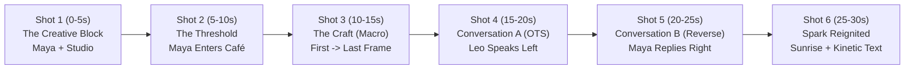

# Participant Hands-On Workbook: Incremental Storytelling with Google Flow, Gemini Omni & Lyria 3.5

Welcome to the **Google Flow & GenMedia Incremental Storytelling Workshop**!

This workbook is structured into **Two Hands-On Parts**:

1. **Part I — The Atomic Prompt Mastery Sandbox** ([Full Sandbox Library](../prompts/00-atomic-prompt-sandbox.md)): Before building a full commercial, you will test **amazing, isolated prompts** that push one specific characteristic at a time—**Camera Angles**, **Warmth & Kelvin Lighting**, **Visual Styles**, **Multi-Object Composition & Physics**, **Gemini Omni Conversational Video Editing**, and **Lyria 3.5 Multimodal Music**.
2. **Part II — The 7-Stage Incremental Commercial Production ("Solis — The 6:00 AM Spark")**: You will start with a **2-sentence story seed** and progressively pile on:
   - **Stage 0**: The 2-Sentence Micro-Story Seed & 3-Act Beat Sheet (`gemini-3.8-flash`)
   - **Stage 1**: Character Generation & Strict Face Consistency (`[CHAR_MAYA]` & `[CHAR_LEO]` in `gemini-3-pro-image`)
   - **Stage 2**: Scene & Product World Generation (`[SCENE_STUDIO]`, `[SCENE_CAFE]`, `[PROP_CUP]`)
   - **Stage 3**: 6-Shot Visual Storyboard & First/Last Keyframe Pairs
   - **Stage 4**: Video Directing with **Gemini Omni 1.1 Flash (`gemini-omni-1.1-flash`)** (Multi-Reference Video, First/Last Keyframing & 360p-to-4K workflow)
   - **Stage 5**: Two-Character Conversation (180° Rule), Native Lip-Sync, `gemini-3.8-flash-tts` Voiceover & **Lyria 3.5 (`lyria-3.5` / `lyria-3-pro-preview`)** Multimodal Score
   - **Stage 6**: **Gemini Omni Conversational Video Editing**, 10s Scene Extension (up to 40s), Kinetic Typography & Scenebuilder Assembly

> **Works Everywhere**: Every exercise works in **Google Flow** (`labs.google/fx/tools/flow` or `flow.cloud.google.com`), **Google AI Studio / Vertex AI Studio** (`gemini-omni-1.1-flash`, `gemini-3-pro-image`, `lyria-3.5`), or third-party GenMedia platforms.

---

# Part I: The Atomic Prompt Mastery Sandbox (Isolated Feature Testing)

> **Goal**: Before combining 5 layers into a full commercial, test what happens when you hold the subject constant and push **one isolated variable** to the extreme in **Image Generation (`gemini-3-pro-image`)** and **Video Generation (`gemini-omni-1.1-flash`)**. (See [`prompts/00-atomic-prompt-sandbox.md`](../prompts/00-atomic-prompt-sandbox.md) for all 18 sandbox prompts!)

### Atomic Test A — Extreme Camera Angles & Single-Take Whip-Pan (`gemini-omni-1.1-flash`)
* **Image Test (90° Overhead Knolling Flat-Lay — `gemini-3-pro-image`)**:
  ```text
  Exact 90-degree overhead bird's-eye flat-lay photograph looking straight down onto a dark walnut architect's drafting table. Arranged in precise geometric knolling alignment: (1) an unrolled cyan architectural bridge blueprint in the center, (2) a matte terracotta cappuccino cup with rosetta latte art in the top-right corner, (3) round tortoiseshell glasses and a brass compass on the left, and (4) a hand in an ochre knit sleeve reaching in from the bottom edge holding a charcoal pencil. 50mm lens, zero perspective distortion, soft directional top-left window light.
  ```
* **Video Test (Continuous Whip-Pan & Crane-Up — `gemini-omni-1.1-flash`)**:
  ```text
  One continuous cinematic shot, no jump cuts. Start on an extreme low-angle macro view at counter height of a barista's hand tamping espresso grounds with a heavy brass tamper. The camera then whip-pans smoothly to the right in one fluid motion across the reclaimed oak counter, following a steaming matte terracotta cup as it slides toward an architect in tortoiseshell glasses, and cranes straight up into a high-angle overhead view looking down as she wraps both hands around the cup. Warm amber Edison lighting, 35mm lens, 24fps. Audio: Crisp metallic tamp click, smooth ceramic slide across wood, warm café murmur.
  ```
* **Gemini Omni Conversational Angle Edit (Follow-Up Turn)**:
  ```text
  Keep the exact same character, espresso bar, cup movement, and audio, but change the camera movement to a slow 180-degree orbital arc shot at eye level that circles smoothly around the terracotta cup as steam rises.
  ```

### Atomic Test B — Warmth, Kelvin Color Temperature & Conversational Relighting
* **Video Test (`gemini-omni-1.1-flash` — Real-Time 7500K Cold to 3000K Warm Sunrise Shift)**:
  ```text
  Static medium-wide shot of a rain-streaked architect's loft desk in cold 7500K blue pre-dawn shadow. Over 6 seconds, storm clouds outside the tall window part rapidly as a blazing 3000K golden sunrise breaks through, sweeping a warm diagonal beam of sunlight across the desk, illuminating a steaming terracotta espresso cup and turning the room from cold cyan to glowing amber. Volumetric light rays in the rising steam. Audio: Distant rain fading out as a warm, resonant morning acoustic chord swells.
  ```
* **Gemini Omni Conversational Relight (Follow-Up Turn)**:
  ```text
  Keep the subject, framing, and camera motion identical, but relight the entire scene to warm 2200K candlelight with soft golden rim lighting and gentle chiaroscuro shadows.
  ```

### Atomic Test C — Radical Visual Styles (Stop-Motion Felt/Clay & 35mm Kodak 500T)
* **Image & Omni Video Test (12fps Tactile Stop-Motion Diorama)**:
  ```text
  Handcrafted miniature stop-motion diorama of a cozy corner coffee shop in the rain. Every element is built from tactile physical craft materials: the barista and architect are sculpted from matte polymer clay with visible subtle thumbprint textures; the rising espresso steam is made of wispy needle-felted merino wool; the rain droplets on the window are clear blown glass beads; the counter is balsa wood. Lit by warm miniature LED practical bulbs, 100mm macro tilt-shift lens with shallow depth of field, animated at a charming 12fps stop-motion frame cadence.
  ```

### Atomic Test D — Multi-Object Composition & Chain-Reaction Physics (`gemini-omni-1.1-flash`)
* **Video Test (Rube Goldberg Multi-Object Chain-Reaction)**:
  ```text
  Continuous smooth macro tracking shot following a precision chain reaction across a wooden café counter: a polished brass marble rolls down a grooved oak ruler, gently taps a row of three white brown-sugar dominoes which topple in sequence, nudging a brass spoon that tips into a matte terracotta cup filled with dark espresso, sending a delicate ripple across the golden crema as a wisp of steam curls upward. Realistic gravity, momentum, and fluid surface tension. 60fps smooth motion, warm studio lighting. Audio: Rolling metallic hum, three soft crisp sugar-cube clicks, a gentle ceramic clink, and liquid swirl.
  ```

---

# Part II: The 7-Stage Incremental Commercial Production ("Solis — The 6:00 AM Spark")

## Stage 0: Start with a Very Short Story (The Seed)

### What We Are Piling On
We establish a **2-sentence story seed** and expand it into a **3-Act Micro-Story** bounded by:
- **2 Characters**: **Maya** (an exhausted 29-year-old architect) and **Leo** (a warm 45-year-old neighborhood barista).
- **2 Locations**: Maya's **cold, rain-streaked studio desk at 5:45 AM** and Leo's **golden, steam-filled corner espresso bar at dawn**.
- **1 Hero Product**: The **matte terracotta `SOLIS` espresso cup**.

### Copy-Paste Prompt 0.1 — Story Seed to 3-Act Beat Sheet (`gemini-3.8-flash`)

#### English Prompt
```text
Act as a Commercial Film Director. I have a two-sentence story seed for a 30-second brand commercial for "Solis Artisan Coffee":
"At 5:45 AM in a rainy city, an exhausted architect staring at a blank blueprint steps into a glowing corner café. One shared laugh and a warm terracotta cup of espresso reignite her creative spark."

Expand this seed into a tight 3-Act Micro-Story:
- Act I (0:00-0:08): The Creative Block (Cold 7500K cyan rain, blank blueprint, exhaustion)
- Act II (0:08-0:22): The Warm Encounter (Stepping into the 2700K golden café, barista craft, a brief 2-line conversation that shifts her mood)
- Act III (0:22-0:30): The Spark Reignited (Back at the studio desk at golden sunrise, bold architectural sketch, brand tagline)

Keep it grounded in two characters (Maya, the architect; Leo, the barista), two locations, and one hero prop (the matte terracotta Solis cup). Focus on emotional beats and visual lighting contrast.
```

#### Prompt en Español (Opcional)
```text
Actúa como Director de Cine Publicitario. Tengo una semilla de historia de dos oraciones para un comercial de 30 segundos de "Solis Artisan Coffee":
"A las 5:45 AM en una ciudad lluviosa, una arquitecta agotada frente a un plano en blanco entra en una cafetería iluminada en la esquina. Una sonrisa compartida y una taza de cerámica terracota de espresso reavivan su chispa creativa."

Expande esta semilla en una Micro-Historia en 3 Actos:
- Acto I (0:00-0:08): El Bloqueo Creativo (Lluvia fría azul cian 7500K, plano en blanco, cansancio)
- Acto II (0:08-0:22): El Encuentro Cálido (Entrada a la cafetería dorada 2700K, preparación del café, breve conversación de 2 líneas que transforma su ánimo)
- Acto III (0:22-0:30): La Chispa Encendida (De vuelta al estudio al amanecer dorado, trazo arquitectónico audaz, eslogan de marca)

Limita el universo a dos personajes (Maya, la arquitecta; Leo, el barista), dos locaciones y un objeto protagonista (la taza terracota mate de Solis).
```

---

## Stage 1: Pile On Character Generation & Face Consistency

### What We Are Piling On
Now we give faces to **Maya** and **Leo**—and make sure their faces **never drift** across shots using:
1. **The Verbal "Identity Anchor Block"**: A 35-word description of facial geometry, skin tone, hair, eyewear, and wardrobe that you copy-paste verbatim into every shot.
2. **Visual Character Ingredients / 4-Angle Turnaround Sheet**: High-resolution studio portraits generated under neutral 5600K light (`gemini-3-pro-image` / Nano Banana Pro) that can be passed directly into **Gemini Omni (`gemini-omni-1.1-flash`)** (which accepts up to **5 reference images** simultaneously!) or pinned in Google Flow's **Ingredients Panel**.

### Your Reusable Identity Anchor Blocks (Save These!)
* **`[CHAR_MAYA]`**:
  > `Maya, a 29-year-old Latina architect with warm olive skin, subtle freckles across the nose, expressive dark brown eyes, shoulder-length wavy raven hair tied in a loose low clip, wearing an oversized ochre knit cardigan over a white crew-neck tee and round tortoiseshell glasses`
* **`[CHAR_LEO]`**:
  > `Leo, a 45-year-old artisanal barista with a neatly trimmed salt-and-pepper beard, warm crinkles around hazel eyes, wearing a charcoal linen apron over a rolled-sleeve chambray shirt`

### Copy-Paste Prompt 1.1 — Protagonist Master Ingredient (`[CHAR_MAYA]`)
```text
Photorealistic cinematic portrait of Maya, a 29-year-old Latina architect with warm olive skin, subtle freckles across the nose, expressive dark brown eyes, shoulder-length wavy raven hair tied in a loose low clip, wearing an oversized ochre knit cardigan over a white crew-neck tee and round tortoiseshell glasses. Neutral studio backdrop with soft 5600K key light, 85mm prime lens, f/2.0, natural skin texture, zero retouching, front-facing three-quarter angle, calm neutral expression, no text, no watermark.
```

### Copy-Paste Prompt 1.2 — 4-Angle Face Consistency Turnaround Sheet (`[CHAR_MAYA_SHEET]`)
```text
A 4-panel character reference sheet on a clean neutral grey background showing the exact same woman in four views:
(1) Front view with a calm neutral expression,
(2) 45-degree three-quarter view with a tired late-night sigh,
(3) Side profile looking down thoughtfully at a desk,
(4) Front close-up with a warm, genuine smile and eyes lighting up.
Subject: Maya, a 29-year-old Latina architect with warm olive skin, subtle freckles across the nose, expressive dark brown eyes, shoulder-length wavy raven hair tied in a loose low clip, wearing an oversized ochre knit cardigan over a white crew-neck tee and round tortoiseshell glasses. Identical facial bone structure and glasses across all four panels, 85mm portrait photography, no text, no labels.
```

### Copy-Paste Prompt 1.3 — Co-Star Master Ingredient (`[CHAR_LEO]`)
```text
Photorealistic cinematic portrait of Leo, a 45-year-old artisanal barista with a neatly trimmed salt-and-pepper beard, warm crinkles around hazel eyes, wearing a charcoal linen apron over a rolled-sleeve chambray shirt. Neutral studio backdrop, soft warm key light, 85mm prime lens, f/2.2, natural skin pores, welcoming gentle smile, no text, no watermark.
```

---

## Stage 2: Pile On Scene & Product World Generation

### What We Are Piling On
Generate **Empty Location Plates** (a stage with no actors) and a standalone **Hero Product Ingredient** so room layouts and brand logos remain rock-solid across all 6 shots.

### Copy-Paste Prompt 2.1 — Location Ingredient A: Cold Rainy Studio (`[SCENE_STUDIO]`)
```text
Wide establishing interior shot of a minimalist architect's loft desk by a tall rain-streaked industrial window at 5:45 AM before dawn. Empty chair, no people. A drafting lamp casts a cool cyan-blue pool of light over an unrolled blank blueprint, architectural scale ruler, and crumpled paper sketches. Raindrops trickle down the window glass with blurred city streetlights outside. Moody teal-and-slate color grade, 35mm anamorphic lens, shallow depth of field, cinematic realism, no text.
```

### Copy-Paste Prompt 2.2 — Location Ingredient B: Warm Corner Café (`[SCENE_CAFE]`)
```text
Medium-wide interior shot of a cozy, wood-paneled artisan espresso bar at dawn. Empty frame with no people. Warm amber Edison bulbs and a polished brass espresso machine gleam with gentle steam rising. Rain is visible outside the fogged front window, contrasting with the rich golden-hour warmth inside. Reclaimed oak counter in the foreground, 35mm cinema lens, Kodak Vision3 500T film look, no text.
```

### Copy-Paste Prompt 2.3 — Object Ingredient: The Hero Product (`[PROP_CUP]`)
```text
Macro studio product photograph of a handcrafted matte terracotta ceramic cappuccino cup resting on a matching terracotta saucer. A minimalist gold embossed sun emblem and the word "SOLIS" are printed cleanly on the front of the cup. Rich velvety hazelnut crema with delicate rosetta latte art on top, a wisp of steam rising. Soft warm rim lighting, neutral dark studio background, 100mm macro lens.
```

---

## Stage 3: Pile On the Visual Storyboard (6-Shot Keyframe Grid)

### What We Are Piling On
Before generating video, combine your **Characters (Stage 1)** + **Locations & Prop (Stage 2)** into **6 Storyboard Keyframes** (including **First Frame + Last Frame pairs** for Shots 3 and 6).



### Copy-Paste Storyboard Keyframe Prompts (Composite with Reference Images)

#### Keyframe 3.1 — Shot 1 Start Frame (`[CHAR_MAYA]` + `[SCENE_STUDIO]`)
```text
Using the character reference for Maya and the studio location reference: Medium close-up cinema still of Maya, a 29-year-old Latina architect with warm olive skin, subtle freckles, wavy raven hair in a low clip, round tortoiseshell glasses, and an ochre knit cardigan, sitting at the rain-streaked architect's desk at 5:45 AM. She rests her chin on her hand, staring at the blank blueprint with a tired, stuck expression. Cool cyan-blue pre-dawn window light reflects on her glasses. 35mm anamorphic lens.
```

#### Keyframe 3.2 — Shot 2 Start Frame (`[CHAR_MAYA]` + `[SCENE_CAFE]`)
```text
Using the character reference for Maya and the café location reference: Medium-wide cinema still of Maya stepping through the glass door of the cozy wood-paneled artisan café out of the cold blue rain. She folds a damp umbrella as warm amber light from the Edison bulbs washes over her face and ochre cardigan. 35mm cinema lens.
```

#### Keyframe 3.3 — Shot 3 Start & End Frame Pair (`[CHAR_LEO]` + `[PROP_CUP]` + `[SCENE_CAFE]`)
* **Shot 3 First Frame**:
  ```text
  Extreme close-up macro shot under the brass espresso portafilter in the warm café: rich dark espresso pouring in dual streams into the matte terracotta ceramic cup embossed with the gold "SOLIS" sun logo.
  ```
* **Shot 3 Last Frame**:
  ```text
  Foreground close-up on the reclaimed oak café counter: Barista Leo's hand (rolled-sleeve chambray shirt) gently slides the steaming matte terracotta "SOLIS" cappuccino cup with hazelnut latte art toward the camera. Warm golden rim lighting, shallow depth of field.
  ```

#### Keyframe 3.4 — Shot 4 Conversation Frame A (`[CHAR_LEO]` + `[CHAR_MAYA]` + `[SCENE_CAFE]`)
```text
Over-the-shoulder medium shot framed from behind Maya's ochre-cardigan shoulder on the far left, focusing on Leo, a 45-year-old barista with a neat salt-and-pepper beard and charcoal linen apron positioned on the right of the frame, looking screen-left toward Maya with a warm, encouraging smile, his hand resting near the steaming terracotta SOLIS cup on the oak counter. 50mm prime lens, shallow depth of field.
```

#### Keyframe 3.5 — Shot 5 Conversation Frame B (`[CHAR_MAYA]` + `[PROP_CUP]` + `[SCENE_CAFE]`)
```text
Reverse-angle medium close-up of Maya, a 29-year-old Latina architect with warm olive skin, round tortoiseshell glasses, and ochre knit cardigan positioned on the left of the frame, looking screen-right toward the barista. She wraps both hands around the warm terracotta SOLIS cup, inhaling the steam as her expression softens into a genuine, relieved smile. Warm golden key light, rainy window blurred behind her, 50mm prime lens.
```

#### Keyframe 3.6 — Shot 6 Start & End Frame Pair (`[CHAR_MAYA]` + `[PROP_CUP]` + `[SCENE_STUDIO]`)
* **Shot 6 First Frame**:
  ```text
  Medium close-up at the architect's loft desk as golden morning sunbeams break through the wet window, replacing the cold blue light. Maya sets the steaming terracotta SOLIS cup down next to her blank blueprint and picks up a charcoal drafting pencil with excited focus.
  ```
* **Shot 6 Last Frame**:
  ```text
  High-angle over-the-shoulder close-up of Maya's hand drawing a bold, sweeping suspension bridge arch across the blueprint in warm golden morning sunlight, with the matte terracotta SOLIS cup steaming beside the drawing.
  ```

---

## Stage 4: Pile On Video Generation with Gemini Omni 1.1 Flash (`gemini-omni-1.1-flash`)

### What We Are Piling On
Now we animate Shots 1, 2, and 3 using **Gemini Omni 1.1 Flash (`gemini-omni-1.1-flash`)**—Google's primary multimodal video generation and conversational editing model (as well as Google Flow's `Ingredients to Video` and `Frames to Video` modes).

> **Why Gemini Omni 1.1 Flash Excels Here**:
> - **Multimodal References**: Accepts **Text + up to 5 Image References + up to 3 Video References (3s)** simultaneously.
> - **First & Last Frame Keyframing**: Smoothly interpolates between `Shot 3 First Frame` and `Shot 3 Last Frame`.
> - **360p Fast Draft -> 4K Upscaling**: Prototype camera moves rapidly in **360p/720p** (3s–10s in 1s increments), then upscale final takes to **1080p or 4K at 24fps**.
> - **Conversational Video Editing**: Refine any take via multi-turn natural language conversation without losing the character's performance!

### Copy-Paste Video Prompt 4.1 — Shot 1 (`gemini-omni-1.1-flash` Multi-Reference Video)
* **Attach References**: `[CHAR_MAYA]` + `[SCENE_STUDIO]` (or pass **Keyframe 3.1**).
```text
Slow, smooth dolly-in toward a medium close-up of Maya, a 29-year-old Latina architect with warm olive skin, subtle freckles, wavy raven hair in a low clip, round tortoiseshell glasses, and an ochre knit cardigan, sitting at her drafting table by a rain-streaked window at 5:45 AM. She exhales a quiet sigh, taps her wooden pencil twice against the blank blueprint, and glances out at the rain. Cold cyan streetlamp reflections glide across her glasses. Shallow depth of field, 35mm anamorphic lens, subtle film grain.
Audio: Soft rhythmic rain pattering against window glass, distant low rumble of thunder, two crisp wooden pencil taps on paper, and a quiet sigh.
```

### Copy-Paste Video Prompt 4.2 — Shot 2 (`gemini-omni-1.1-flash` Multi-Reference Video)
* **Attach References**: `[CHAR_MAYA]` + `[SCENE_CAFE]` (or pass **Keyframe 3.2**).
```text
Smooth lateral tracking shot following Maya, a 29-year-old Latina architect in her ochre knit cardigan and round tortoiseshell glasses, as she pushes open the glass café door from the rainy blue street and steps into the warm golden glow of the artisan espresso bar. A brass door chime rings softly as she shakes raindrops off her umbrella and looks toward the counter with relief. 35mm cinema lens, warm Kodak 500T color grade.
Audio: Rain sound fading as the wooden door closes, a warm brass shop bell chime, gentle espresso machine hiss, and cozy acoustic café ambiance.
```

### Copy-Paste Video Prompt 4.3 — Shot 3 (`gemini-omni-1.1-flash` First & Last Frame Keyframing)
* **Set First Frame**: `Shot 3 First Frame` (Espresso pouring into `SOLIS` cup).
* **Set Last Frame**: `Shot 3 Last Frame` (Leo sliding the `SOLIS` cup across the oak counter).
```text
Macro cinematic tracking shot transitioning smoothly from the first frame to the last frame. Rich, syrupy espresso finishes pouring into the matte terracotta SOLIS cup, forming velvety hazelnut crema. Barista Leo's hand gently lifts the cup from the machine, places it onto the reclaimed oak counter, and slides it smoothly toward the foreground camera as a wisp of golden steam curls upward. 100mm macro cinema lens, 60fps slow-motion feel.
Audio: Rich espresso extraction hiss, gentle ceramic clink on oak wood, warm fingerpicked acoustic guitar notes entering softly.
```

---

## Stage 5: Pile On Two-Character Dialogue, `gemini-3.8-flash-tts` & Latest `lyria-3.5` Score

### What We Are Piling On
Now we add **spoken dialogue** across Shots 4 and 5, plus our studio voiceover and **Lyria 3.5** multimodal score!
To make Leo and Maya look directly at each other across the counter edit (**The 180-Degree Rule**):
- **Shot 4 (Leo)**: Positioned on the **right**, looking **screen-left**, speaking in a warm baritone.
- **Shot 5 (Maya)**: Positioned on the **left**, looking **screen-right**, smiling and replying.
- **Omni Advantage**: Because `gemini-omni-1.1-flash` supports up to **5 image references**, you can attach `[CHAR_LEO]`, `[CHAR_MAYA]`, `[SCENE_CAFE]`, and `[PROP_CUP]` all at once!

### Copy-Paste Video Prompt 5.1 — Shot 4: Leo Speaks (`gemini-omni-1.1-flash` + Native Dialogue)
* **Attach References**: `[CHAR_LEO]` + `[CHAR_MAYA]` + `[SCENE_CAFE]` + `[PROP_CUP]` (or **Keyframe 3.4**).
```text
Over-the-shoulder medium shot framed from behind Maya's ochre-cardigan shoulder on the left, focusing on Leo, a 45-year-old barista with a neat salt-and-pepper beard and charcoal linen apron positioned on the right of the frame, looking screen-left with a warm, knowing smile. As his hand rests beside the steaming terracotta SOLIS cup on the counter, Leo speaks clearly in a warm, grounded baritone voice: 'Rough night with the blueprints? Start with this—the lines always follow.' Warm amber café lighting, 50mm prime lens, natural lip synchronization.
Audio: Cozy café ambiance, soft rain outside, and Leo speaking in a warm baritone voice: 'Rough night with the blueprints? Start with this—the lines always follow.'
```

### Copy-Paste Video Prompt 5.2 — Shot 5: Maya Replies (`gemini-omni-1.1-flash` + Native Dialogue)
* **Attach References**: `[CHAR_MAYA]` + `[SCENE_CAFE]` + `[PROP_CUP]` (or **Keyframe 3.5**).
```text
Reverse-angle medium close-up of Maya, a 29-year-old Latina architect with warm olive skin, round tortoiseshell glasses, and ochre knit cardigan positioned on the left of the frame, looking screen-right toward the barista. She wraps both hands around the warm terracotta SOLIS cup, inhales the rising steam, and her tired expression melts into a genuine, relieved smile. She replies softly with a light chuckle: 'You just saved the whole skyline, Leo.' Warm golden key light on her face, 50mm prime lens, natural lip synchronization.
Audio: Gentle café murmur and Maya speaking in a warm, relieved voice with a subtle laugh: 'You just saved the whole skyline, Leo.'
```

### Copy-Paste Audio Prompt 5.3 — Expressive Brand Voiceover (`gemini-3.8-flash-tts`)
* **Model**: `gemini-3.8-flash-tts` (Voices: `Kore`, `Aoede`, `Charon`, `Puck`, `Fenrir`)
```text
Style Prompt: Warm, intimate, cinematic commercial narrator speaking softly at sunrise with inspiring calm.
Text: "[sigh] Every bold idea starts before the sun rises. [short pause] Solis Artisan Roast. Awaken the craft."
```

### Copy-Paste Music Prompt 5.4 — Latest Lyria 3.5 Multimodal Commercial Score (`lyria-3.5` / `lyria-3-pro-preview` / `lyria-3-clip-preview`)
* **Attach Image Reference (Optional Multimodal Input in `lyria-3.5` / `lyria-3-pro-preview`)**: Pass **Keyframe 3.3 Last Frame** (the steaming terracotta `SOLIS` cup on the warm oak counter) + the prompt below to generate **44.1 kHz high-fidelity stereo** music:
```text
30-second cinematic commercial soundtrack in 44.1kHz stereo, 92 BPM:
[0:00–0:08 Intro]: Sparse, intimate felt piano notes and delicate rain ambiance in a minor key (5:45 AM creative block);
[0:08–0:20 Groove]: Transitions into warm fingerpicked acoustic guitar and upright bass as a café door chime rings;
[0:20–0:30 Crescendo Outro]: Swells with uplifting chamber strings and a gentle brushed-snare groove, resolving on a glowing major chord at sunrise.
```

---

## Stage 6: Pile On Gemini Omni Conversational Editing, 10s Extension & Scenebuilder Finale

### What We Are Piling On
Finally, we use **Gemini Omni's Conversational Multi-Turn Editing**, **10-Second Scene Extension (up to 40s total)**, and **Google Flow Scenebuilder (`Extend` & `Jump To`)** to finish our 30-second commercial.

### Step 6.1 — Multi-Turn Conversational Video Edit (`gemini-omni-1.1-flash`)
Take **Shot 5** and send a conversational follow-up turn in `gemini-omni-1.1-flash` to refine the lighting and steam without losing Maya's spoken performance:
```text
Keep Maya's exact facial performance, spoken dialogue, and framing, but intensify the warm 2700K golden rim light on her glasses and make the rising espresso steam from the SOLIS cup denser and more luminous.
```

### Step 6.2 — Scene Extension (`gemini-omni-1.1-flash` 3–10s Extend or Scenebuilder `Extend`)
Extend the end of **Shot 5** (right after Maya says *"You just saved the whole skyline, Leo"*):
```text
Continue the shot seamlessly for 4 seconds as Maya takes her first slow sip from the matte terracotta SOLIS cup. Her eyes widen subtly with sudden creative inspiration, and she glances down toward her sketchbook with newfound energy.
```

### Step 6.3 — Shot 6 Finale with In-Video Kinetic Typography (`gemini-omni-1.1-flash` / `Jump To`)
Use **First & Last Frame Keyframing** (with **Keyframe 3.6 First & Last Frames**) or Scenebuilder **`Jump To`** in `gemini-omni-1.1-flash`:
```text
Smooth push-in tilting down over Maya's shoulder at her studio desk as warm golden sunrise streams through the wet window, illuminating the steaming terracotta SOLIS cup beside her blueprint. Maya's charcoal pencil sweeps across the paper in one confident motion, completing a soaring architectural bridge arch. As steam rises from the SOLIS cup in the final 2 seconds, clean gold serif typography reading "SOLIS — AWAKEN THE CRAFT" materializes smoothly in the warm sunbeam. 35mm lens, 4K upscale.
Audio: Uplifting acoustic guitar and strings crescendo, crisp charcoal sketching stroke on heavy paper, followed by warm voiceover: 'Solis. Awaken the craft.'
```

### Step 6.4 — Final Verification Checklist
- [ ] Did you test isolated variables first in **Part I (Camera Angles, Kelvin Warmth, Styles, 5-Object Lock)**?
- [ ] Does Maya's face, tortoiseshell glasses, and ochre cardigan remain locked across Shots 1, 2, 5, and 6?
- [ ] In Shots 4 and 5, do Leo (looking screen-left) and Maya (looking screen-right) make direct eye contact across the cut?
- [ ] Did you use **`gemini-omni-1.1-flash` conversational editing** on at least one clip and score the commercial with **`lyria-3.5`**?
